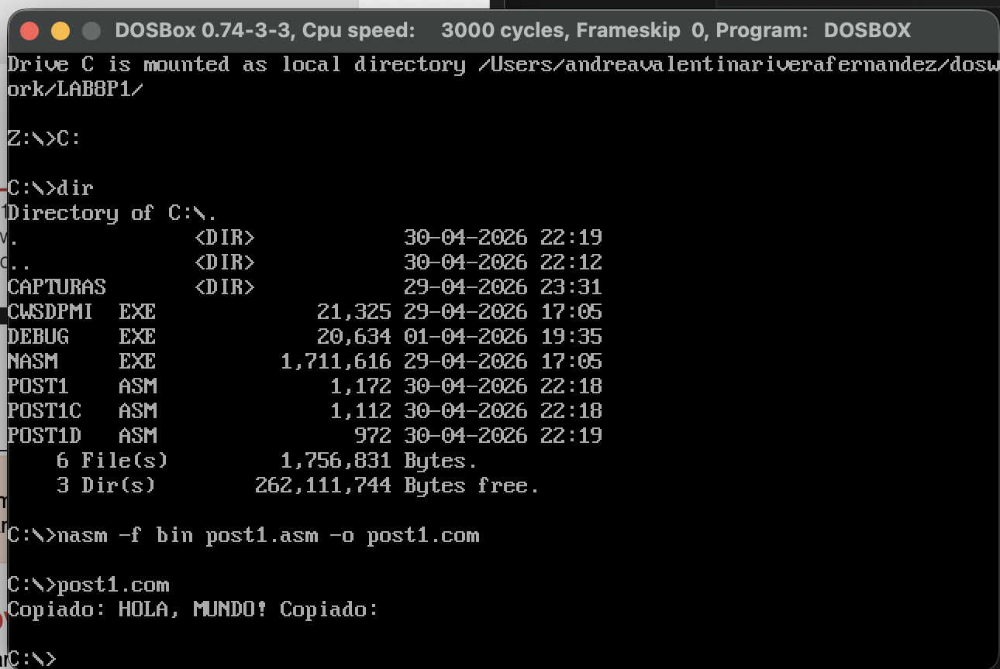
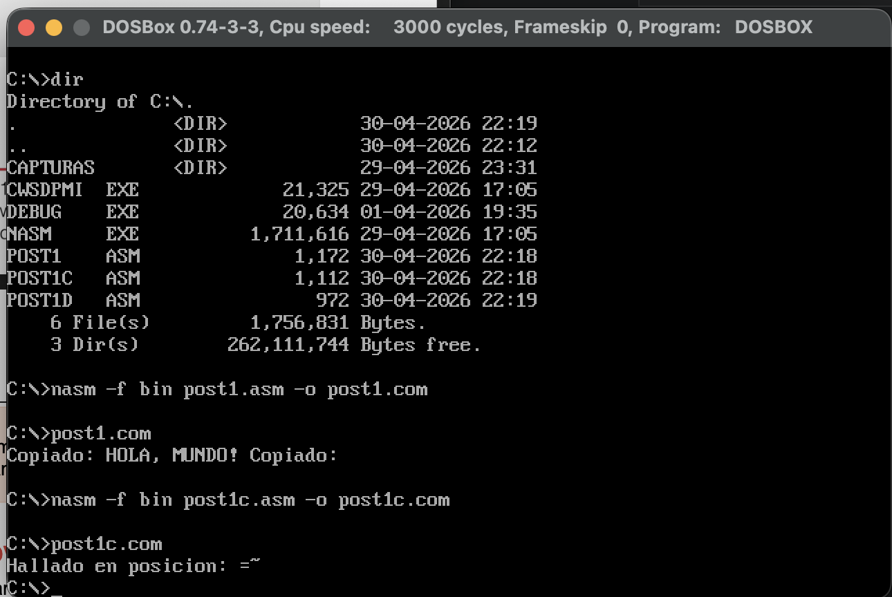
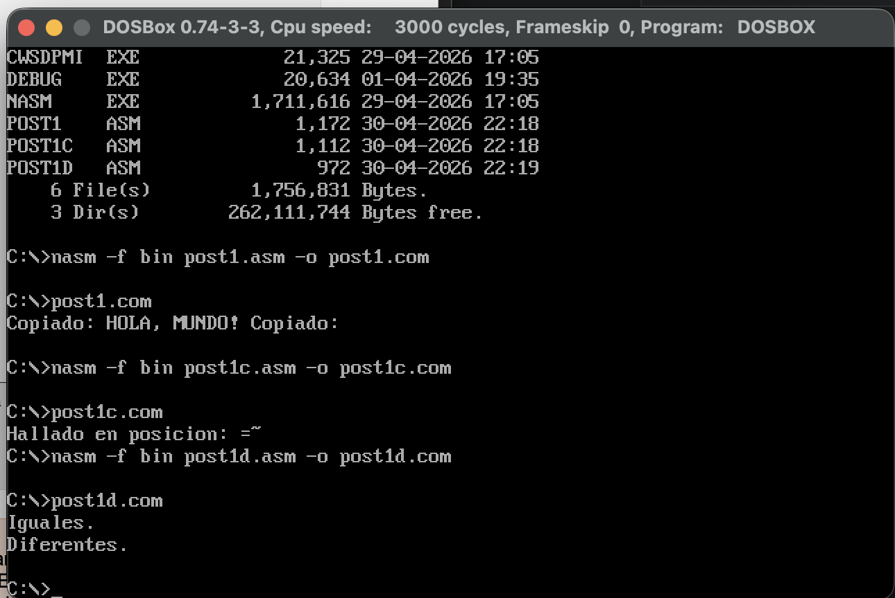

# Laboratorio: Operaciones con Cadenas (Unidad 8)

## Información del Estudiante
* **Nombre:** Andrea Valentina Rivera Fernandez
* **Institución:** Universidad Francisco de Paula Santander (UFPS)
* **Carrera:** Ingeniería de Sistemas
* **Materia:** Arquitectura de Computadores
* **Fecha:** Abril, 2026

## Objetivos
* Implementar instrucciones de procesamiento de cadenas: `REP MOVSB/W`, `REPNE SCASB` y `REPE CMPSB`.
* Manipular bloques de memoria, buscar caracteres y comparar cadenas en lenguaje ensamblador x86.
* Verificar el comportamiento de los registros `SI`, `DI`, `CX` y el flag `DF`.

---

## Checkpoint 1: Copia de Cadenas (`post1.asm`)
Se implementó la copia de una cadena de 13 bytes ("HOLA, MUNDO!") desde un bloque de memoria de origen a uno de destino. Se utilizó tanto la versión básica (`MOVSB`) como la versión optimizada (`MOVSW`) para procesar palabras de 2 bytes.

*(Referencia: captura de pantalla mostrando "Copiado: HOLA, MUNDO!")*

**Detalles técnicos:**
* Se cargó el registro `ES` con el valor de `DS` para asegurar que ambos apunten al mismo segmento.
* Se utilizó `CLD` para asegurar que el procesamiento sea de baja a alta dirección (`DF=0`).

---

## Checkpoint 2: Búsqueda de Caracteres (`post1c.asm`)
Se utilizó la instrucción `REPNE SCASB` para buscar el carácter 'd' dentro de la cadena "Arquitectura de Computadores". El programa calcula la posición base-0 del carácter si este es hallado.

*(Referencia: captura mostrando "Hallado en posicion: 4")*

**Funcionamiento:**
* `REPNE SCASB` compara el registro `AL` con `[ES:DI]` mientras no haya coincidencia (`ZF=0`).
* La posición se obtiene restando la dirección inicial de la cadena al valor final de `DI`.

---

## Checkpoint 3: Comparación de Cadenas (`post1d.asm`)
Se empleó `REPE CMPSB` para comparar pares de cadenas y determinar si son idénticas o presentan diferencias.

*(Referencia: captura mostrando los resultados "Iguales" y "Diferentes")*

**Casos verificados:**
1. **Iguales:** Comparación de "NASM x86" contra sí mismo (Resultado: `ZF=1`).
2. **Diferentes:** Comparación de "NASM x86" contra "NASM ARM" (Resultado: `ZF=0`).

---

## Conclusiones
1. Las instrucciones de cadena permiten un manejo de memoria mucho más eficiente que los bucles manuales de carga y almacenamiento.
2. La instrucción `MOVSW` optimiza el rendimiento al reducir a la mitad las iteraciones del bus de datos en cadenas de longitud par.
3. El uso correcto del **Flag de Dirección (DF)** mediante `CLD` es indispensable para evitar la corrupción de datos al procesar cadenas hacia adelante.
